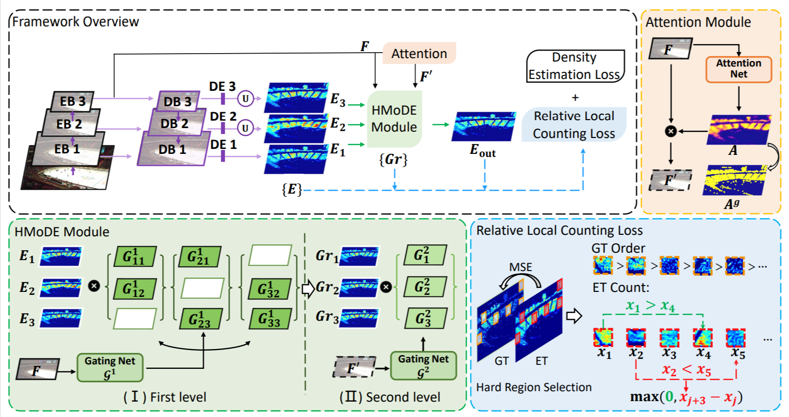

# Redesigning Multi-Scale Neural Network for Crowd Counting

This is the official implementation of 'Redesigning Multi-Scale Neural Network for Crowd Counting'. [[arXiv](https://arxiv.org/abs/2208.02894)]




## Installation

Python ≥ 3.6.

To install other required packages, run:

``` 
pip install -r requirements.txt
```


## Training

We will release the rest of the code later.


## Evaluation

- Download the processed dataset ShanghaiTech part A([Link](https://drive.google.com/file/d/1QNLhNiUry77a6uY6dp5hLOs_bUQsU3Cd/view?usp=sharing)). For the preprocessing code, please refer to [this](https://github.com/TencentYoutuResearch/CrowdCounting-SASNet/blob/main/prepare_dataset.py).
- Download our SHA model [here](https://drive.google.com/file/d/10m-k31ok3ET1ZMs8qJXqJQgH44yNgSlT/view?usp=sharing).
- Modify the path to the processed dataset and pretrained model in 'setting.py' in datasets/SHHA
- Run 'test.py'


## Acknowledgements

Part of codes are borrowed from [C^3 Framework](https://github.com/gjy3035/C-3-Framework) and [SASNet](https://github.com/TencentYoutuResearch/CrowdCounting-SASNet). Thanks for their great work!


## Citation

If you find this work useful, please cite

``` citation
@article{du2022redesigning,
  title={Redesigning Multi-Scale Neural Network for Crowd Counting},
  author={Du, Zhipeng and Shi, Miaojing and Deng, Jiankang and Zafeiriou, Stefanos},
  journal={arXiv preprint arXiv:2208.02894},
  year={2022}
}
```

